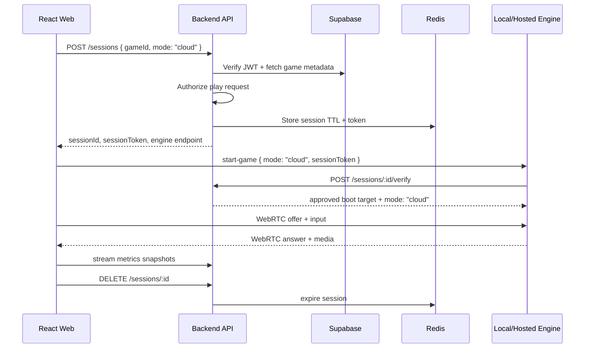
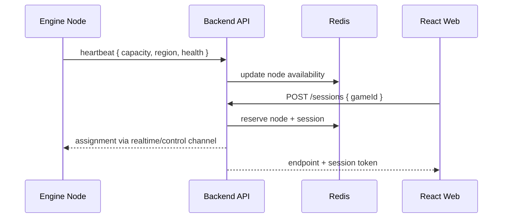

# Target Architecture Refurbishment

Last reviewed: 2026-05-25

Purpose: sketch the next project structure before adding a real backend or doing a larger rewrite. This is a planning document only, not an implementation record.

## Why Refurbish Now

The project has moved past "React app plus local engine experiment." The current local engine works, but responsibilities are now packed into a few large files:

- `app_server/server.js`: Express routes, Socket.IO signaling, auth boundary, health checks, ROM download validation, process lifecycle, input translation, session cleanup, and error relay.
- `app_server/main.js`: Electron UI lifecycle, Docker build/run orchestration, token generation, health polling, and shutdown.
- `web_server/src/pages/user/Player.tsx`: stream player, telemetry display toggle, comments, reactions, reporting, play-count tracking, and game metadata.

The next step should separate the product into clear deployable units:

1. Public web app.
2. Backend control plane.
3. Local desktop orchestrator.
4. Engine runtime inside Docker.
5. Shared contracts/types.
6. Supabase schema/storage/auth layer.

## Current High-Level Shape

```text
Pixelated-Studio-Edition/
  web_server/
    src/
      pages/
      components/
      lib/
  app_server/
    main.js              # Electron + Docker orchestration
    server.js            # Local engine API + signaling + process control
    camera.py            # GStreamer/WebRTC sender
    Dockerfile
    index.html
    preload.js
  supabase/
    migrations/
  assets/
  .context/
```

This shape was good for proving the concept. It is now getting blurry because `app_server/` means both "desktop app" and "engine server," and the public web app still does too much direct Supabase work for workflows that will need authorization, quotas, and audit logs.

## Target Monorepo Shape

Recommended target tree:

```text
Pixelated-Studio-Edition/
  apps/
    web/
      src/
        app/                         # routing and app shell
        features/
          library/
          local-vault/
          player/
          profile/
          publishing/
          admin/
        components/
          layout/
          ui/
        lib/
          api-client/
          supabase/
          engine-local/
      package.json
      vite.config.ts

    desktop/
      src/
        main/
          docker/
            buildEngineImage.ts
            runEngineContainer.ts
            healthPoller.ts
          ipc/
          security/
          main.ts
        renderer/
          index.html
          preload.ts
          ui/
      package.json

  services/
    api/
      src/
        server.ts
        config/
        middleware/
          requireSupabaseUser.ts
          requireAdmin.ts
          rateLimit.ts
        modules/
          auth/
          games/
          sessions/
          uploads/
          moderation/
          metrics/
          local-pairing/
        realtime/
          socketServer.ts
          sessionGateway.ts
        jobs/
          cleanupExpiredSessions.ts
      package.json
      Dockerfile

  engine/
    runtime/
      src/
        server/
          index.js
          http/
            healthRoutes.js
            localVaultRoutes.js
          signaling/
            socketAuth.js
            sessionRooms.js
            relayHandlers.js
          runtime/
            processManager.js
            bootGame.js
            cleanupSession.js
            virtualDisplay.js
          roms/
            cloudRomDownloader.js
            localRomStore.js
          input/
            translateKey.js
            injectKey.js
          telemetry/
            healthSnapshot.js
            engineErrors.js
        camera/
          camera.py
      Dockerfile
      retroarch/
        retroarch.cfg

  packages/
    shared/
      src/
        contracts/
          sessions.ts
          telemetry.ts
          games.ts
          users.ts
        validation/
        constants/
      package.json

  supabase/
    migrations/
    seed/
    policies/

  docs/
    web.md
    desktop.md
    engine.md
    backend.md
    deployment.md

  .context/
    current-infrastructure.md
    project-flows.md
    suggestions.md
    target-architecture-refurbishment.md
```

## Responsibility Split

### `apps/web`

Owns the user experience only.

Should keep:

- Library browsing.
- Player UI.
- Local Vault UI.
- Profile/comments/reactions UI.
- Admin UI shell.
- Local engine pairing UI.

Should stop owning over time:

- ROM URL resolution.
- Play-count mutation.
- Moderation actions.
- Upload path decisions.
- Session authorization.
- Direct admin-sensitive writes.

### `services/api`

This is the new backend control plane.

Owns:

- Supabase JWT verification.
- Session creation/authorization.
- Game session ownership and lifecycle records.
- ROM manifest resolution.
- Signed upload decisions.
- Admin action authorization and audit logs.
- Play-count increments.
- Rate limiting.
- TURN credential issuing later.
- Metrics ingestion.
- Hosted engine/node allocation later.

First useful endpoints:

```text
GET    /health
GET    /me
GET    /me/permissions

POST   /sessions
GET    /sessions/:sessionId
DELETE /sessions/:sessionId

POST   /uploads/submissions/presign
POST   /games/:gameId/play-count

POST   /moderation/comments/:commentId/report
POST   /admin/reports/:reportId/action

POST   /metrics/stream
POST   /engine-nodes/:nodeId/heartbeat
```

First useful realtime channels:

```text
/realtime/player       # browser session control and backend-issued session auth
/realtime/engine-node  # hosted engine nodes report availability and receive assignments
```

### `apps/desktop`

Owns the user-local app wrapper.

Should keep:

- Docker availability checks.
- Pull/build engine image.
- Start/stop local engine container.
- Generate and display local pairing token.
- Poll local engine health.
- Local-only status/log UI.

Should not own:

- Public session authorization.
- Game library logic.
- Supabase admin logic.

### `engine/runtime`

Owns the emulator runtime.

Should keep:

- Local health endpoint.
- Pairing-token validation for local mode.
- Socket.IO signaling relay in local mode.
- ROM download validation as a defense-in-depth layer.
- RetroArch process lifecycle.
- GStreamer bridge lifecycle.
- Xvfb/PulseAudio lifecycle.
- Input injection.
- Local Vault file storage.

Should be split from `server.js` into modules because it is runtime infrastructure, not one app script.

Suggested `server.js` split:

```text
engine/runtime/src/server/
  index.js
  config.js

  http/
    createHttpServer.js
    healthRoutes.js
    localVaultRoutes.js
    errorHandlers.js

  signaling/
    createSocketServer.js
    socketAuth.js
    sessionRooms.js
    signalingRelay.js
    inputHandlers.js
    engineErrorHandlers.js

  runtime/
    processManager.js
    virtualDisplay.js
    bootGame.js
    cleanupSession.js

  roms/
    cloudRomDownloader.js
    localRomStore.js
    sanitizePaths.js

  input/
    translateKey.js
    injectKey.js

  telemetry/
    healthSnapshot.js
    streamEvents.js
```

## Backend Hosting Recommendation

Short version: start with Render for the backend control plane, keep Supabase for Postgres/Auth/Storage, add Upstash Redis or Render Redis for ephemeral session/rate-limit state, and keep the hosted engine fleet separate for later.

### Recommended First Backend Host: Render

Why it fits this project now:

- It can host a normal long-running Node/Fastify/Express backend.
- It supports WebSocket-style services, which matters for session control and node heartbeats.
- It can deploy from GitHub or from Docker images.
- It has private networking between services in the same region, useful once Redis or workers enter the picture.

Tradeoffs:

- It is not the final answer for GPU/cloud-game runtime nodes.
- WebSocket clients need reconnection/backoff because platform deploys and maintenance can interrupt connections.
- Horizontal scale means you need Redis/pub-sub or sticky session strategy for realtime routing.

### Good Alternative: Fly.io

Why it is interesting:

- Better conceptual match for future engine nodes because Fly Machines are container/VM-oriented and can be started/stopped programmatically.
- Good fit later for "spin up an engine container near a user" or "keep a small regional pool warm."

Tradeoffs:

- More operationally explicit than Render.
- I would not start here for the first backend unless you want to learn/deal with the infra model now.

### Use Supabase Edge Functions Selectively

Good uses:

- Lightweight webhooks.
- Small auth-adjacent API helpers.
- Database-triggered glue.
- Simple low-latency TypeScript functions close to users.

Avoid using them as the main control plane because:

- The backend needs normal long-running server behavior, realtime connections, job cleanup, and probably Redis.
- Hosted Supabase Edge Functions have runtime limits like memory, CPU time, wall-clock duration, and request idle timeout.
- The engine/session scheduler should be a normal service with clear lifecycle and observability.

### Backend Hosting Decision Matrix

```text
Need                                      Best first choice
---------------------------------------   -----------------
Simple Node API + WebSockets              Render Web Service
Redis for TTL/rate limits/locks           Upstash Redis or Render Redis
Supabase auth/db/storage                  Keep Supabase
Webhooks or small serverless glue         Supabase Edge Functions
Future regional engine containers         Fly.io Machines, ECS, or Kubernetes
GPU-heavy hosted cloud gaming             Dedicated GPU hosts or specialized cloud GPU
```

## Suggested Backend Stack

Recommended first stack:

```text
Runtime:      Node.js + TypeScript
Framework:    Fastify
Auth:         Supabase JWT verification
Database:     Supabase Postgres
Cache/TTL:    Redis
Realtime:     Socket.IO or ws
Validation:   Zod
Logging:      pino
Deploy:       Render Web Service
```

Why Fastify over Express:

- Better schema/validation ergonomics.
- Good performance with plain Node.
- Cleaner plugin/module boundaries.

Express is still acceptable if the goal is minimal migration, but this is a refurbishment point, so Fastify is worth considering.

## New Session Flow With Backend

Target flow for cloud/library games:



Target flow for future hosted nodes:



## Migration Plan

### Phase A: Rename Nothing, Extract Intent

Goal: reduce risk before moving folders.

1. Document the target architecture.
2. Split `app_server/server.js` internally into modules inside the current folder.
3. Split `Player.tsx` into player, comments, reactions, reporting, and metadata hooks/components.
4. Keep imports stable and behavior unchanged.

### Phase B: Add Backend In Place

Goal: introduce the control plane without breaking local mode.

1. Add `services/api`.
2. Add `GET /health`.
3. Add Supabase JWT verification.
4. Add `POST /sessions` for cloud game sessions.
5. Keep Local Vault/local engine direct pairing working as a compatibility mode.
6. Move play-count increments through backend.
7. Move ROM URL resolution through backend.

### Phase C: Move To Target Tree

Goal: make the repo match the architecture.

1. Move `web_server` to `apps/web`.
2. Move Electron pieces from `app_server` to `apps/desktop`.
3. Move Docker runtime pieces from `app_server` to `engine/runtime`.
4. Add shared contracts in `packages/shared`.
5. Update scripts and READMEs.

### Phase D: Hosted Engine Fleet

Goal: make cloud gaming actually cloud-native.

1. Add engine-node registration and heartbeat.
2. Add backend node allocation.
3. Add session TTL cleanup.
4. Add TURN credentials.
5. Add metrics persistence.
6. Add per-session or per-node isolation strategy.

## What Not To Do Yet

- Do not turn Supabase Edge Functions into the main backend.
- Do not move every file at once before extracting modules.
- Do not make the first backend responsible for hosted engine allocation on day one.
- Do not remove the local desktop engine path; it is still the best demo/dev loop.
- Do not add Redis before there is at least one backend endpoint that needs TTL, locks, or rate limits.

## Recommended Next Work

Before coding the backend:

1. Split `app_server/server.js` into engine runtime modules in its current location.
2. Split `Player.tsx` into smaller player feature modules.
3. Create `services/api` with only health/config/auth scaffolding.
4. Add a backend README and deployment notes.

This sequence keeps the refactor understandable: first make the current code modular, then introduce the backend, then move directories when the boundaries are real.

## Sources Checked For Hosting Notes

- Render Web Services can host dynamic apps, deploy from Git or Docker images, assign public URLs/custom domains, and use private networking between same-region services: https://render-web.onrender.com/docs/web-services
- Render documents WebSocket support for web services and notes that clients should handle reconnects/backoff because connections can be interrupted: https://render.com/docs/websocket
- Fly Machines are image-based VM/container instances with configurable services, autostart/autostop, and sizes, which makes them a candidate for future engine nodes: https://fly.io/docs/machines/api/machines-resource/
- Supabase Edge Functions are useful globally distributed TypeScript functions, but hosted functions have documented runtime/platform limits including memory, CPU time, duration, and request idle timeout: https://supabase.com/docs/guides/functions/limits
